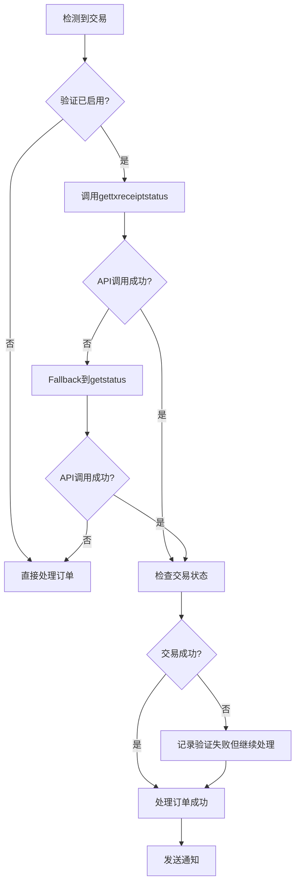

# Etherscan V2 Transaction API 集成文档

## 概述

项目已集成Etherscan V2 Transaction API，提供增强的交易验证功能，确保订单处理的可靠性和准确性。

## 功能特性

### 🔍 **交易验证方法**

1. **Transaction Receipt Status** (`gettxreceiptstatus`)
   - **用途**: 检查交易执行状态
   - **适用**: Byzantium分叉后的交易
   - **响应**: `status` (1=成功, 0=失败)
   - **优先级**: 首选方法

2. **Contract Execution Status** (`getstatus`)  
   - **用途**: 检查智能合约执行状态
   - **适用**: 所有交易
   - **响应**: `isError` (0=成功, 1=失败)
   - **优先级**: 备用方法

### 🔧 **核心组件**

#### TransactionVerifier
负责与Etherscan V2 API交互的核心验证器：

```go
verifier := monitor.NewTransactionVerifier()
result, err := verifier.VerifyTransaction(ctx, "POLY", "0x123...")

if result.IsSuccess {
    log.Info("交易验证成功")
} else {
    log.Warn("交易验证失败: " + result.ErrorMessage)
}
```

#### EnhancedTransactionHandler  
集成验证功能的增强交易处理器：

```go
handler := monitor.NewEnhancedTransactionHandler()
err := handler.ProcessSuccessfulTransaction(ctx, order, fromAddr, txHash, time.Now())
```

## API格式

### 请求格式
```
https://api.etherscan.io/v2/api
?chainid={CHAIN_ID}
&module=transaction
&action={ACTION}
&txhash={TX_HASH}
&apikey={API_KEY}
```

### 支持的链ID
| 链名称 | Chain ID | 说明 |
|--------|----------|------|
| Polygon | 137 | Polygon主网 |
| BSC | 56 | Binance Smart Chain |
| Optimism | 10 | Optimism主网 |
| Arbitrum | 42161 | Arbitrum One |
| X-Layer | 196 | X-Layer主网 |
| Ethereum | 1 | 以太坊主网 |

## 配置要求

### 环境变量
```bash
# 必需: Etherscan V2 API密钥
ETHERSCAN_API_KEY=your_api_key_here

# 可选: 启用交易确认验证 (默认false)
TRADE_IS_CONFIRMED=true
```

### API密钥申请
1. 访问 [Etherscan.io](https://etherscan.io/register)
2. 注册账户并验证邮箱
3. 生成API密钥
4. 一个密钥支持所有EVM链查询

## 使用方式

### 1. 自动集成 (推荐)

系统会在适当时机自动进行交易验证：

```go
// 原有代码保持不变
if order.OrderSetSucc(fromAddress, txHash, time.Now()) == nil {
    go notify.OrderNotify(order)
}

// 系统自动在后台进行验证(如果启用)
```

### 2. 显式调用

```go
verifier := monitor.NewTransactionVerifier()

// 单个交易验证
result, err := verifier.VerifyTransaction(ctx, "POLY", "0x123...")
if err != nil {
    log.Error("验证失败: " + err.Error())
    return
}

fmt.Printf("验证结果: 成功=%t, 方法=%s\\n", result.IsSuccess, result.Method)
```

### 3. 批量验证

```go
transactions := []struct {
    Chain  string
    TxHash string
}{
    {"POLY", "0x123..."},
    {"BSC", "0x456..."},
}

results, err := verifier.VerifyTransactionBatch(ctx, transactions)
for _, result := range results {
    fmt.Printf("链=%s, 交易=%s, 成功=%t\\n", 
        result.Chain, result.TxHash, result.IsSuccess)
}
```

## 验证流程



## 响应示例

### Transaction Receipt Status
```json
{
  "status": "1",
  "message": "OK",
  "result": {
    "status": "1"  // 1=成功, 0=失败
  }
}
```

### Contract Execution Status  
```json
{
  "status": "1", 
  "message": "OK",
  "result": {
    "isError": "0"  // 0=成功, 1=失败  
  }
}
```

## 错误处理

### 向后兼容性
- 验证失败不会阻止订单处理
- API密钥未配置时自动跳过验证
- 网络错误时使用原有逻辑

### 错误类型
1. **API限制**: 自动重试机制 + 指数退避
2. **链不支持**: 记录警告但继续处理
3. **交易失败**: 记录日志但保持兼容性

## 性能考量

### API调用限制
- **免费版**: 5次/秒, 100,000次/天
- **Pro版**: 更高限制
- **批量验证**: 自动添加200ms间隔

### 优化建议
1. 仅在必要时启用验证
2. 使用批量接口减少调用次数  
3. 监控API配额使用情况
4. 考虑缓存验证结果

## 监控指标

### 可用统计信息
```go
handler := monitor.NewEnhancedTransactionHandler()
stats := handler.GetVerificationStats()

// 输出:
// {
//   "enhanced_handler_enabled": true,
//   "verifier_enabled": true, 
//   "api_key_configured": true
// }
```

### 日志示例
```
[INFO] 开始验证交易: chain=POLY, txhash=0x123...
[INFO] 交易验证完成: method=gettxreceiptstatus, success=true, error=
[WARN] 交易验证显示失败: chain=BSC, txhash=0x456..., error=交易执行失败
```

## 升级指南

### 从现有系统升级

1. **设置API密钥**:
   ```bash
   export ETHERSCAN_API_KEY=your_key_here
   ```

2. **启用验证** (可选):
   ```bash  
   export TRADE_IS_CONFIRMED=true
   ```

3. **无需代码修改**: 现有代码自动兼容

### 测试验证
```bash
# 检查API密钥配置
curl "https://api.etherscan.io/v2/api?chainid=137&module=transaction&action=getstatus&txhash=0x123&apikey=YOUR_KEY"

# 验证响应格式
{
  "status": "1",
  "message": "OK", 
  "result": {"isError": "0"}
}
```

## 最佳实践

1. **渐进式启用**: 先在测试环境验证
2. **监控API使用**: 避免超出限制
3. **日志审查**: 定期检查验证结果
4. **性能平衡**: 在安全性和性能间找平衡

---

## 总结

Etherscan V2 Transaction API集成为系统提供了额外的安全层，通过双重验证确保交易处理的准确性。该功能设计为完全向后兼容，可根据需要灵活启用或禁用。