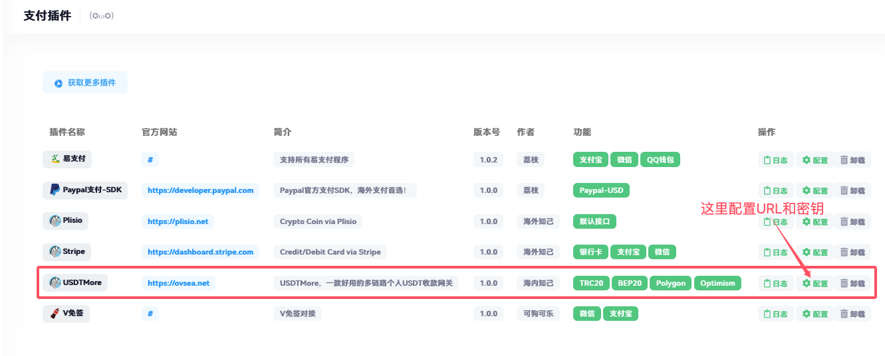
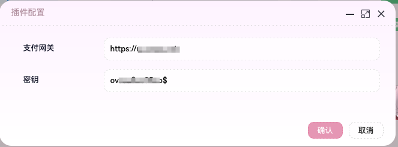
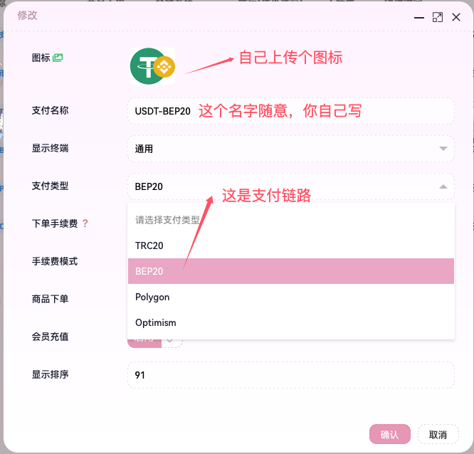
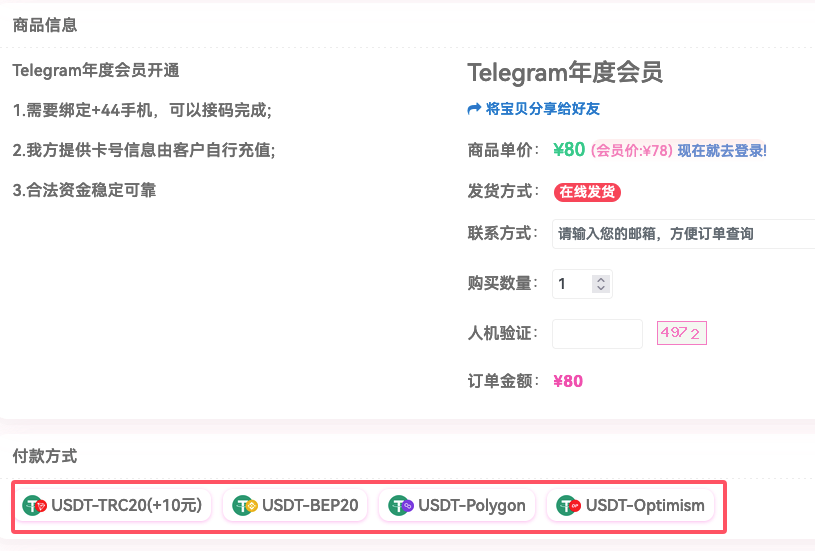

# USDTMore ACG-FAKA插件

## 使用方法

### 1. 安装插件文件
将`USDTMore`目录里面的文件复制到 `/app/Pay` 下面

### 2. 启用插件
登录异次元后台，进入支付管理，支付插件， 这时候会看到USDTMore插件



### 3. 配置插件
配置对应的URL和密钥：
- **URL**: 你的USDTMore的地址，不需要加后缀（例如：`http://localhost:6080`）
- **密钥**: 在USDTMore的`.env`文件中的`API_TOKEN`



### 4. 添加支付方式
进入支付管理，支付接口中增加支付方式



### 5. 修改回调代码
主要涉及2处代码修改：

**app/Controller/User/Api/RechargeNotification.php**，在return之前增加解码代码：
```php
// 增加USDT的处理逻辑
if($handle == 'USDTMore'){
    $data = json_decode(file_get_contents('php://input'), true);
}

return $this->recharge->callback($handle, $data);
```

**app/Controller/User/Api/Order.php**，在获取参数之后增加解码代码：
```php
$handle = $_GET['_PARAMETER'][0];
$data = $_POST;
if (empty($data)) {
    $data = $_REQUEST;
    unset($data['s']);
}

// 增加USDT的处理逻辑
if($handle == 'USDTMore'){
    $data = json_decode(file_get_contents('php://input'), true);
}
```

### 6. 最终效果


## 重要更新

### 签名算法变更 (v2.1.0+)
- **旧版本**: 使用 MD5 签名算法
- **新版本**: 使用 HMAC-SHA256 签名算法

**升级说明**：
1. 如果您使用的是USDTMore v2.1.0或更高版本，请确保使用最新的插件文件
2. 新的签名算法提供更高的安全性
3. 插件会自动使用正确的签名算法，无需手动配置

### 支持的区块链网络
- **TRON** (TRC20-USDT)
- **Ethereum** (ERC20-USDT) 
- **BSC** (BEP20-USDT)
- **Polygon** (Polygon-USDT)
- **Arbitrum** (Arbitrum-USDT)
- **Optimism** (Optimism-USDT)
- **X-Layer** (X-Layer-USDT)

## 配置说明

### 环境变量配置
确保USDTMore的`.env`文件包含以下配置：
```env
# API认证令牌
API_TOKEN=your_api_token_here

# EVM API配置 (统一使用Etherscan API)
ETHERSCAN_API_KEY=your_etherscan_api_key

# 支付配置
PAYMENT_TIMEOUT=1800
MIN_AMOUNT=1.0
MAX_AMOUNT=10000.0
```

## 技术支持
如遇到问题，请检查：
1. USDTMore服务是否正常运行
2. API接口地址是否正确
3. 认证token是否有效
4. 签名算法是否匹配
5. 网络连接是否正常

## 版本兼容性
- USDTMore v2.1.0+: 使用HMAC-SHA256签名
- USDTMore v2.0.x: 使用MD5签名（已弃用）

建议升级到最新版本以获得更好的安全性和稳定性。